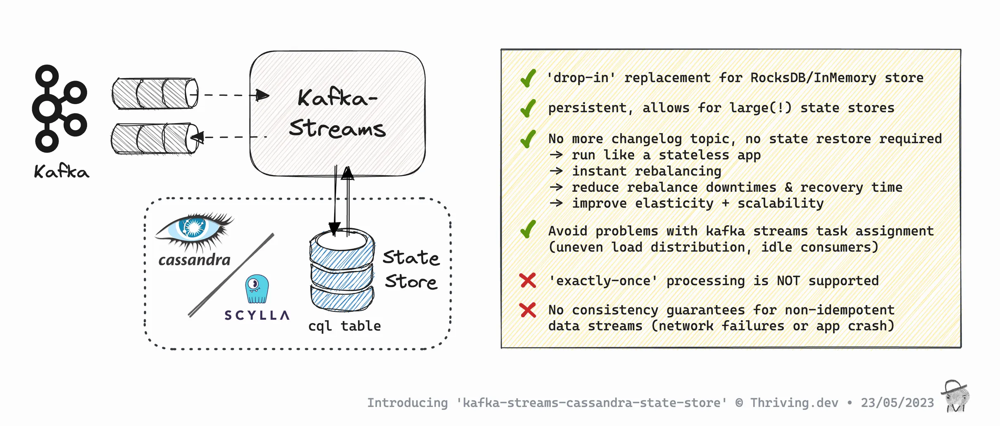

# kafka-streams-cassandra-state-store

[](https://github.com/hartmut-co-uk/kafka-streams-cassandra-state-store/actions/workflows/build-gradle-project.yml)

## Overview 
Kafka Streams State Store implementation that persists data to Apache Cassandra.
For now, only KeyValueStore type is supported.



ℹ️ [Kafka Streams](https://kafka.apache.org/documentation/streams/) is a Java client library for building stream-processing applications and microservices, where the input and output data are stored in Kafka clusters.   
ℹ️ [Apache Cassandra](https://cassandra.apache.org/) is a free and open-source, distributed, wide-column store, NoSQL database management system designed to handle large amounts of data across many commodity servers, providing high availability with no single point of failure.

### Blog post introducing the library + Demo YouTube

* **Blog:** https://thriving.dev/blog/introducing-kafka-streams-cassandra-state-store
* **Demo:** https://youtu.be/2Co9-8E-uJE


### Project Status
⚠️ Current project status is to be considered **EXPERIMENTAL!!** ⚠️   
Please carefully read documentation provided on [store types](#store-types) and [limitations](#known-limitations).

## Stack

### Implemented/compiled with
* Java 17
* kafka-streams 3.5
* datastax java-driver-core 4.16.0

### Supported client-libs
* Kafka Streams 2.7.0+ (maybe even earlier versions, but wasn't tested further back)
* Datastax java client (v4) `'com.datastax.oss:java-driver-core:4.16.0'`
* ScyllaDB shard-aware datastax java client (v4) fork `'com.scylladb:java-driver-core:4.15.0.1'`

### Supported databases
* Apache Cassandra 3.11
* Apache Cassandra 4.0
* Apache Cassandra 4.1
* ScyllaDB (should work from 4.3+)

#### Integration Tests
* JUnit 5, AssertJ
* [testcontainers](https://www.testcontainers.org/)

## Get it!

**kafka-streams-cassandra-state-store** is available on [Maven Central](https://central.sonatype.com/artifact/dev.thriving.oss/kafka-streams-cassandra-state-store/):

#### Maven
```xml
<dependency>
    <groupId>dev.thriving.oss</groupId>
    <artifactId>kafka-streams-cassandra-state-store</artifactId>
    <version>${version}</version>
</dependency>
```

Classes of this library are in the package `dev.thriving.oss.kafka.streams.cassandra.state.store`.

#### Gradle (Groovy DSL)
```groovy
implementation 'dev.thriving.oss:kafka-streams-cassandra-state-store:${version}'
```

### Datastax Java Client

To avoid library collisions, the cassandra java driver is non-transitive.    
Therefore you have to choose and add a _datastax driver based_ java client dependency to your project.

* Datastax java client (v4) `'com.datastax.oss:java-driver-core:4.16.0'` (works for Cassandra 3.11, 4.0, 4.11)
* ScyllaDB shard-aware datastax java client (v4) fork `'com.scylladb:java-driver-core:4.15.0.1'`

## Usage
### Quick start

#### ‼️**Important:** notes upfront

1. Disable logging => `withLoggingDisabled()`    
   ...enabled by default, kafka streams is 'logging' the events making up the store's state against a _changelog topic_ to be able to restore state following a rebalance or application restart. Since cassandra is a permanent external store, state does not need to be _restored_ but is always available.   
1. Disable caching => `withCachingDisabled()`    
   ...enabled by default, kafka streams is buffering writes - which is not what we want when working with cassandra state store  
1. Do not use [standby replicas](https://docs.confluent.io/platform/current/streams/developer-guide/config-streams.html#streams-developer-guide-standby-replicas) => `num.standby.replicas=0`    
   ...standby replicas are used to minimize the latency of task failover by keeping shadow copies of local state stores as a hot standby. The state store backed by cassandra does not need to be restored or re-balanced since all streams instances can directly access any partitions state.

#### High-level DSL <> StoreSupplier

When using the high-level DSL, i.e., `StreamsBuilder`, users create `StoreSupplier`s that can be further customized via `Materialized`.

For example, a topic read as `KTable` can be materialized into a cassandra k/v store with custom key/value serdes, with logging and caching disabled:

```java
StreamsBuilder builder = new StreamsBuilder();
KTable<Long,String> table = builder.table(
  "topicName",
  Materialized.<Long,String>as(
                 CassandraStores.builder(session, "store-name")
                         .keyValueStore()
              )
              .withKeySerde(Serdes.Long())
              .withValueSerde(Serdes.String())
              .withLoggingDisabled()
              .withCachingDisabled());
```

#### Processor API <> StoreBuilder

When using the Processor API, i.e., `Topology`, users create `StoreBuilder`s that can be attached to `Processor`s.

For example, you can create a cassandra stringKey value store with custom key/value serdes, logging and caching disabled like:

```java
Topology topology = new Topology();

StoreBuilder<KeyValueStore<String, Long>> storeBuilder = Stores.keyValueStoreBuilder(
                CassandraStores.builder(session, "store-name")
                        .keyValueStore(),
                Serdes.String(),
                Serdes.Long())
        .withLoggingDisabled()
        .withCachingDisabled();

topology.addStateStore(storeBuilder);
```

### Examples
Examples (incl. docker-compose setup) can be found in the [/examples](/examples) folder.

Instructions on how to run and work with the example apps can be found at the individual example root folder's README file.

Take a look at the notorious word-count example with Cassandra 4 -> [/examples/word-count-cassandra4](/examples/word-count-cassandra4).

#### Common Requirements for running the examples
- Docker to run
- [kcat](https://github.com/edenhill/kcat) for interacting with Kafka (consume/produce)

### Store Types
kafka-streams-cassandra-state-store comes with 2 different store types:
- keyValueStore
- globalKeyValueStore

#### keyValueStore (recommended default)
A persistent `KeyValueStore<Bytes, byte[]>`.
The underlying cassandra table is **partitioned by** the store context **task partition**.
Therefore, all CRUD operations against this store always query by and return results for a single stream task.

#### globalKeyValueStore
A persistent `KeyValueStore<Bytes, byte[]>`.
The underlying cassandra table uses the **record key as sole /PRIMARY KEY/**.
Therefore, all CRUD operations against this store work from any streams task and therefore always are “global”.
Due to the nature of cassandra tables having a single PK (no clustering key), this store supports only a limited number of operations.

This global store should not be confused with a Kafka Streams Global Store!
It has to be used as a non-global (regular!) streams KeyValue state store - though it allows to read entries from any streams context (streams task/thread).

**Tip:** This store type can be useful when exposing state store access via an API. Each running instance of your app can serve all requests without the need to proxy the request to the right instance having the streams task assigned for the key in question.

⚠️ For **querying** this **global CassandraKeyValueStore**, make sure to restrict the `WrappingStoreProvider` to a single (assigned) partition.
The KafkaStreams instance returns a `CompositeReadOnlyKeyValueStore` that holds the `WrappingStoreProvider`, wrapping all assigned tasks' stores. Without the correct `StoreQueryParameters` the same query is executed multiple times (for all assigned partitions) and combines multiple identical results.


#### Interactive Queries
The `CassandraStateStore` interface provides static helper methods to get a correctly configured read-only store facade:

```java
// get a store to exec interactive queries
ReadOnlyKeyValueStore<String, Long> store = CassandraStateStore.readOnlyGlobalKeyValueStore(streams, STORE_NAME);
        
// Get the value from the store
Long value = store.get(key);
```

Example provided: [examples/global-store-restapi](tree/main/examples/global-store-restapi)

#### Supported operations by store type

|                         | keyValueStore | globalKeyValueStore |
| ----------------------- |---------------|---------------------|
| get                     | ✅             | ✅                   |
| put                     | ✅             | ✅                   |
| putIfAbsent             | ✅             | ✅                   |
| putAll                  | ✅             | ✅                   |
| delete                  | ✅             | ✅                   |
| range                   | ✅             | ❌                   |
| reverseRange            | ✅             | ❌                   |
| all                     | ✅             | ✅                   |
| reverseAll              | ✅             | ❌                   |
| prefixScan              | ✅             | ❌                   |
| approximateNumEntries   | ✅*            | ✅*                  |
| query::RangeQuery       | ✅             | ❌                   |
| query::KeyQuery         | ✅             | ✅                   |
| query::WindowKeyQuery   | ❌             | ❌                   |
| query::WindowRangeQuery | ❌             | ❌                   |

*opt-in required

### Builder
The `CassandraStores` class provides a method `public static CassandraStores builder(final CqlSession session, final String name)` that returns an instance of _CassandraStores_ which ultimately is used to build an instance of `KeyValueBytesStoreSupplier` to add to your topology.

Basic usage example:
```java
CassandraStores.builder(session, "word-grouped-count")
        .withKeyspace("")
        .keyValueStore()
```

Advanced usage example:
```java
CassandraStores.builder(session, "word-grouped-count")
        .withKeyspace("poc")
        .withKeyspace(true)
        .withTableOptions("""
                compaction = { 'class' : 'LeveledCompactionStrategy' }
                AND default_time_to_live = 86400
                """)
        .withTableNameFn(storeName ->
            String.format("%s_kstreams_store", storeName.toLowerCase().replaceAll("[^a-z0-9_]", "_")))
        .keyValueStore()
```

Please also see [Quick start](#quick-start) for full kafka-streams example. 

#### Builder options

##### `withKeyspace(String keyspace)`
The keyspace for the state store to operate in. By default, the provided `CqlSession` _session-keyspace_ is used.

##### `withTableOptions(String tableOptions)`
A CQL table has a number of options that can be set at creation.

Please omit `WITH ` prefix.
Multiple options can be added using `AND`, e.g. `"table_option1 AND table_option2"`.

Recommended compaction strategy is 'LeveledCompactionStrategy' which is applied by default.   
-> Do not forget to add when overwriting table options.

Please refer to table options of your cassandra cluster.
- [Cassandra 4](https://cassandra.apache.org/doc/latest/cassandra/cql/ddl.html#create-table-options)
- [ScyllaDB](https://docs.scylladb.com/stable/cql/ddl.html#table-options)

Please note this config will only apply upon initial table creation. ('ALTER TABLE' is not yet supported).

Default: `"compaction = { 'class' : 'LeveledCompactionStrategy' }"`

##### `withTableNameFn(Function<String, String> tableNameFn)`
Customize how the state store cassandra table is named, based on the kstreams store name.

⚠️ Please note _changing_ the store name _for a pre-existing store_ will result in a **new empty table** to be created.

Default: `${normalisedStoreName}_kstreams_store` - normalise := lowercase, replaces all [^a-z0-9_] with '_'   
  e.g. ("TEXT3.word-count2") -> "text3_word_count2_kstreams_store"

##### `withCountAllEnabled()`
Enable (opt-in) the CassandraKeyValueStore to use `SELECT COUNT(*)` when [ReadOnlyKeyValueStore#approximateNumEntries()](https://kafka.apache.org/34/javadoc/org/apache/kafka/streams/state/ReadOnlyKeyValueStore.html#approximateNumEntries()) is invoked.

⚠️ Cassandra/CQL does not support getting approximate counts. Exact row count using `SELECT COUNT(*)` requires significant CPU and I/O resources and may be quite slow depending on store size... use with care!

Disabled by default.

##### `withCreateTableDisabled()`
Disable (opt-out) automatic table creation during store initialization.   
Enabled by default.

##### `withDdlExecutionProfile(String ddlExecutionProfile)`
Set the execution profile to be used by the driver for all DDL (Data Definition Language) queries.

ℹ️ Note: Only applies if table creation ({@link CassandraStores#withCreateTableDisabled()}) is enabled (default).   
If no profile is set - DDL queries are executed with consistency `ALL`.   
When using a custom profile, it is recommended to also set consistency=ALL   
(Reason: avoid issues with concurrent schema updates)

Reference: https://docs.datastax.com/en/developer/java-driver/4.15/manual/core/configuration/#execution-profiles

Must be a non-blank String.   
Set to `null` to disable (basic applies).

Default: `null`

##### `withDmlExecutionProfile(String dmlExecutionProfile)`
Set the execution profile to be used by the driver for all DML (Data Manipulation Language) queries.

Reference: https://docs.datastax.com/en/developer/java-driver/4.15/manual/core/configuration/#execution-profiles"

Must be a non-blank String.   
Set to `null` to disable (basic applies).

Default: `null`


## Fine Print 

### Known Limitations
Adding additional infrastructure for data persistence external to Kafka comes with certain risks and constraints.

#### Consistency
Kafka Streams supports _at-least-once_ and _exactly-once_ processing guarantees. At-least-once semantics is enabled by default.

Kafka Streams _exactly-once_ processing guarantees is using Kafka transactions. These transactions wrap the entirety of processing a message throughout your streams topology, including messages published to outbound topic(s), changelog topic(s), and consumer offsets topic(s). 

This is possible through transactional interaction with a single distributed system (Apache Kafka). Bringing an external system (Cassandra) into play breaks this pattern. Once data is written to the database it can't be rolled back in the event of a subsequent error / failure to complete the current message processing. 

⚠️ => If you need strong consistency, have _exactly-once_ processing enabled (streams config: `processing.guarantee="exactly_once_v2"`), and/or your processing logic is not fully idempotent then using **kafka-streams-cassandra-state-store** is discouraged! ⚠️

ℹ️ Please note this is also true when using kafka-streams with the native state stores (RocksDB/InMemory) with *at-least-once* processing.guarantee (default).

For more information on Kafka Streams processing guarantees, check the sources referenced below.

##### References
- https://medium.com/lydtech-consulting/kafka-streams-transactions-exactly-once-messaging-82194b50900a
- https://docs.confluent.io/platform/current/streams/developer-guide/config-streams.html#processing-guarantee
- https://docs.confluent.io/platform/current/streams/concepts.html#processing-guarantees

#### Incomplete Implementation of Interfaces `StateStore` & `ReadOnlyKeyValueStore`

Not all methods have been implemented. Please check [store types method support table](#store-types) above for more details. 


### Cassandra Specifics

#### Underlying CQL Schema

##### keyValueStore
Using defaults, for a state store named "word-count" following CQL Schema applies:
```sql
CREATE TABLE IF NOT EXISTS word_count_kstreams_store (
    partition int,
    key blob,
    time timestamp,
    value blob,
    PRIMARY KEY ((partition), key)
) WITH compaction = { 'class' : 'LeveledCompactionStrategy' }
```

##### globalKeyValueStore
Using defaults, for a state store named "clicks-global" following CQL Schema applies:
```sql
CREATE TABLE IF NOT EXISTS clicks_global_kstreams_store (
    key blob,
    time timestamp,
    value blob,
    PRIMARY KEY (key)
) WITH compaction = { 'class' : 'LeveledCompactionStrategy' }
```

#### Feat: Cassandra table with default TTL

💡 **Tip:** Cassandra has a table option `default_time_to_live` (default expiration time (“TTL”) in seconds for a table) which can be useful for certain use cases where data (state) can or should expire.

Please note writes to cassandra are made with system time. The table TTL will therefore apply based on the time of write (not stream time). 

#### Cassandra table partitioning (avoiding large partitions)

Kafka is persisting data in segments and is built for sequential r/w. As long as there's sufficient disk storage space available to brokers, a high number of messages for a single topic partition is not a problem.

Apache Cassandra on the other hand can get inefficient (up to severe failures such as load shedding, dropped messages, and to crashed and downed nodes) when partition size grows too large.
The reason is that searching becomes too slow as search within partition is slow. Also, it puts a lot of pressure on (JVM) heap.

⚠️ The community has offered a standard recommendation for Cassandra users to keep Partitions under 400MB, and preferably under 100MB.

For the current implementation, the cassandra table created for the 'default' key-value store is partitioned by the kafka _partition key_ ("wide partition pattern").
Please keep these issues in mind when working with relevant data volumes.    
In case you don't need to query your store / only lookup by key ('range', 'prefixScan'; ref [Supported operations by store type](#supported-operations-by-store-type)) it's recommended to use `globalKeyValueStore` rather than `keyValueStore` since it is partitioned by the _event key_ (:= primary key).

ℹ️ References:
- blog post on [Wide Partitions in Apache Cassandra 3.11](https://thelastpickle.com/blog/2019/01/11/wide-partitions-cassandra-3-11.html)    
  Note: in case anyone has funded knowledge if/how this has changed with Cassandra 4, please share!
- [stackoverflow question](https://stackoverflow.com/questions/68237371/wide-partition-pattern-in-cassandra)


## Development

### Requirements

- Java 17
- Docker (integration tests with testcontainers)

### Build

This library is bundled with Gradle. Please note The build task also depends on task testInt which runs integration tests using testcontainers (build <- check <- intTest).

```shell
./gradlew clean build
```

### Integration test

Integration tests can be run separately via

```shell
./gradlew :kafka-streams-cassandra-state-store:intTest
```


## Roadmap

- [x] MVP
  - [x] CQL Schema
  - [x] implementation
- [x] restructure code
  - [x] split implementation & examples
  - [x] Abstract store, introduce Repo, KeySerdes (Byte <> ByteBuffer|String)
  - [x] CassandraStores Builder, configurable
    - [x] table name fn
    - [x] keyspace
    - [x] ~~table default ttl~~
    - [x] ~~compaction strategy~~
    - [x] ~~compression~~
    - [x] fully customizable table options (support both Cassandra & ScyllaDB)
- [x] examples
  - [x] WordCount Cassandra 4
  - [x] WordCount Cassandra 3 (v4 client lib)
  - [x] WordCount ScyllaDB
  - [x] WordCount Processor + all + range + prefixScan + approximateNumEntries
  - [x] GlobalCassandraStore + KStream enrichment 
  - [x] Quarkus examples app as GraalVM native image (https://github.com/thriving-dev/kafka-streams-cassandra-state-store/issues/7)
- [x] additional features
  - [x] ~~Prefix scan with `stringKeyValueStore` (ScyllaDB only)~~ (removed with v0.3)
  - [ ] ~~Prefix scan with `stringKeyValueStore` (Cassandra with SASIIndex? https://stackoverflow.com/questions/49247092/order-by-and-like-in-same-cassandra-query/49268543#49268543)~~
  - [x] `ReadOnlyKeyValueStore.prefixScan` implementation using range (see InMemoryKeyValueStore implementation)
  - [x] Implement `globalKeyValueStore`
  - [ ] Support KIP-889: Versioned State Stores (to be delivered with kafka 3.5.0)
- [x] OpenSource
  - [x] choose + add license
  - [x] add CHANGELOG.md
  - [x] add CODE_OF_CONDUCT.md
  - [x] add CONTRIBUTING.md
  - [x] polishing
  - [x] make repo public
  - [x] Publish to maven central (?) https://h4pehl.medium.com/publish-your-gradle-artifacts-to-maven-central-f74a0af085b1
    - [x] request namespace ownership
    - [x] add JavaDocs
    - [x] other -> maven central compliant https://central.sonatype.org/publish/requirements/
    - [x] gradle plugin to publish to maven central https://julien.ponge.org/blog/publishing-from-gradle-to-maven-central-with-github-actions/
    - [x] publish snapshot version 0.1.0-SNAPSHOT
    - [x] add gradle release plugin
    - [x] tag + publish initial version 0.1.0
- [ ] Ops
  - [x] github actions to build (+test)
  - [ ] ? add renovate
    - (vs. depandabot?)
      - https://github.com/renovatebot/github-action
      - https://docs.renovatebot.com/java/
  - [ ] github actions to publish to maven central (snapshot, releases) https://julien.ponge.org/blog/publishing-from-gradle-to-maven-central-with-github-actions/
- [x] Write Documentation
  - [x] summary
  - [x] compatibility cassandra 3.11, 4.x, ScyllaDB
  - [x] cleanup README
  - [x] install
  - [x] quick start
  - [x] link to examples
  - [x] overview store types
  - [x] usage, builder, config options
  - [x] limitations
  - [x] Cassandra Specifics
    - [x] Underlying CQL Schema
    - [x] Feat: Cassandra table with default TTL
    - [ ] r/w consistency
    - [ ] profiles for DDL/DML
    - [ ] retry-policy https://docs.datastax.com/en/developer/java-driver/4.15/manual/core/retries/
    - [ ] ? request throttling, e.g. rate-based to avoid overloading the db? https://docs.datastax.com/en/developer/java-driver/4.15/manual/core/throttling/
  - [ ] (Caching options)
  - [ ] Exception/error handling
- [x] Security
  - [x] test against 'CQL injection' via `withTableOptions(..)` 
        => tried to add `compaction = { 'class' : 'LeveledCompactionStrategy' };DROP TABLE xyz` which fails due to wrong syntax in Cassandra 3.11/4.1 & ScyllaDB 5.1  
- [ ] bugs
  - [x] cassandra concurrent schema updates (concurrent table auto-creation) lead to schema collisions (tables are created by each task-thread in parallel on first application start) (https://github.com/thriving-dev/kafka-streams-cassandra-state-store/issues/12)
  - [ ] exception handling (https://github.com/thriving-dev/kafka-streams-cassandra-state-store/issues/13)
- [ ] tests
  - [ ] unit tests (?)
  - [x] integration test using testcontainers
    - [x] WordCountTest
    - [x] WordCountInteractiveQueriesTest
    - [x] WordCountGlobalStoreTest
- [ ] Advanced/Features/POCs Planned/Considered
  - [ ] correctness / completeness (https://github.com/thriving-dev/kafka-streams-cassandra-state-store/issues/14)
    - [ ] wrap stores with MeteredKeyValueStore ?
    - [ ] provide `timestampedKeyValueStore`
    - [ ] ? (TBC) logging / caching is always disabled (because it's not implemented to wrap store by CassandraStores...) 
      - [ ] always disable logging + caching?
  - [ ] add additional store types
    - [ ] WindowedStore functionality, example, ...
    - [ ] ...?
  - [x] Add builder config options
    - [x] opt-out to avoid tables to be auto-created (https://github.com/thriving-dev/kafka-streams-cassandra-state-store/issues/9)
    - [x] allow setting execution profiles to be used for queries, separate for DDL|DML (https://github.com/thriving-dev/kafka-streams-cassandra-state-store/issues/11)
    - [x] opt-in to enable count using `SELECT COUNT(*)` for `approximateNumEntries` (https://github.com/thriving-dev/kafka-streams-cassandra-state-store/issues/10)
  - [ ] (?) simple inMemory read cache -> Caffeine? (separate lib?) (https://github.com/thriving-dev/kafka-streams-cassandra-state-store/issues/18)
  - [ ] Benchmark
  - [ ] Explore buffered writes ('caching') -> parallel writes to Cassandra to boost performance?
  - [ ] add Metrics?
    - [ ] (?) Metrics also for Caches?
  - [ ] move (parts of) documentation to separate pages/wiki? 

